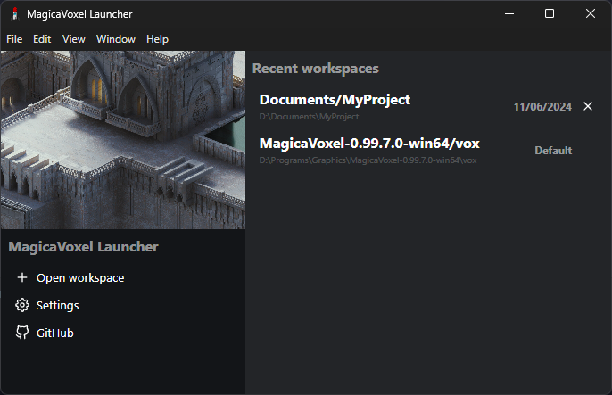

# magicavoxel-launcher

A simple launcher for MagicaVoxel that allows you to select a folder as a workspace and then open the program with that workspace.

  

It is useful for those who want to keep their MagicaVoxel files organized in different folders (e.g., one folder for each project).

## How it works 🛠️

When you select a folder as your workspace, the launcher will edit the `config.txt` file (and make a backup of the original file) to set the workspace to the selected folder. Then, it will open MagicaVoxel with the edited `config.txt` file.

## Installation 📦

You can download the latest version of the launcher from the [releases page](https://github.com/Kan-A-Pesh/magicavoxel-launcher/releases).

## Usage 🚀

Simply run the launcher and select a folder as your workspace. The launcher will then open MagicaVoxel with that workspace.

## Contributing 🤝

Any contributions you make are **greatly appreciated**. If you have any suggestions, bug reports, or pull requests, please open an issue or a pull request.

## License 📝

This project is licensed under the MIT License - see the [LICENSE](LICENSE) file for details.
